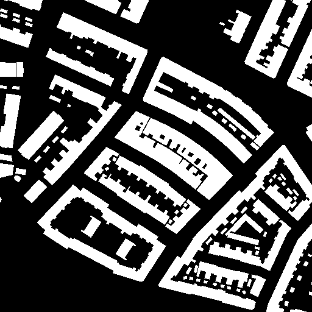
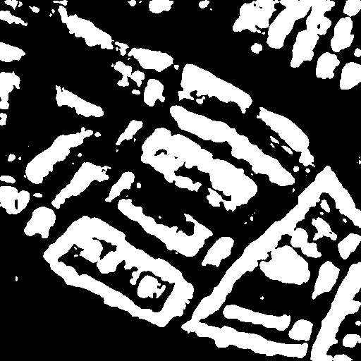
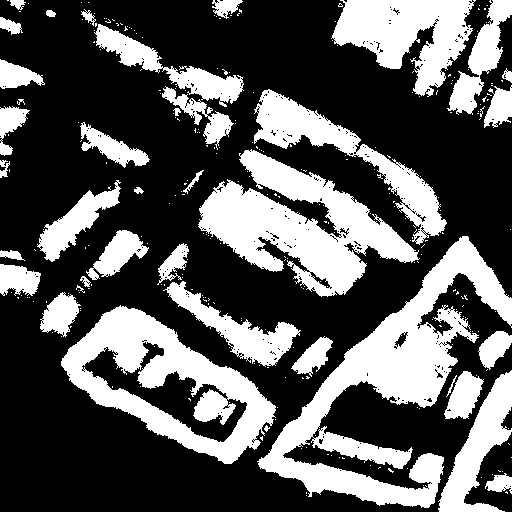
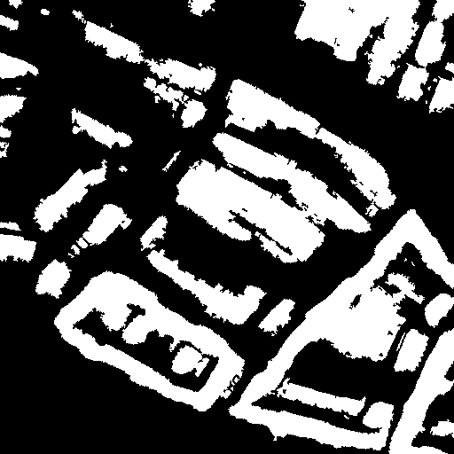

# Nested UNet (UNet++) for Building Detection

## Demo

|  |  |  |  |  |
|:-------------------------------:|:-----------------------------:|:-----------------------------:|:-----------------------------:|:-----------------------------:|
| Input Image | Ground Truth | UNet++ Output | Post-prosessed by Fully Connected CRF |  Post-prosessed by Fully Connected CRF and Denoising |

<table>
    <thead>
        <tr>
            <th align="center" style="width:20%"></th>
            <th align="center" style="width:20%"></th>
            <th align="center" style="width:20%"></th>
            <th align="center" style="width:20%"></th>
            <th align="center"></th>
        </tr>
    </thead>
    <tbody>
        <tr>
            <td align="center">Input Image</td>
            <td align="center">Ground Truth</td>
            <td align="center">UNet++ Output</td>
            <td align="center">Post-prosessed by Fully Connected CRF</td>
            <td align="center">Post-prosessed by Fully Connected CRF and Denoising</td>
        </tr>
    </tbody>
</table>