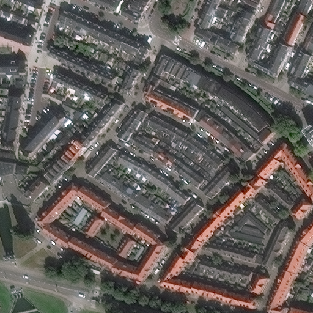

# Nested UNet (UNet++) for Building Detection

## Demo

|  |  |  |  |  |
|:-------------------------------:|:-----------------------------:|:-----------------------------:|:-----------------------------:|:-----------------------------:|
| Input Image | Ground Truth | UNet++ Output | Post-prosessed by Fully Connected CRF |  Post-prosessed by Fully Connected CRF and Denoising |
